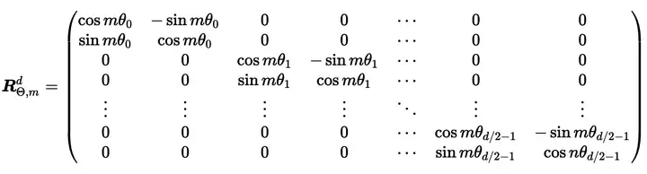

## llm的上下文长度
llm的上下文指，在使用模型时，输入加输出的 tokens 总和。 如果字数超出限制，则超出的部分会被丢弃。 

## 长上下文模型
获得一个长的上下文模型，一般有两种途径。一种是用长文本直接训练，第二种选择已训练好的模型，通过改造其位置编码，再微调训练。

### 1、直接训练
要训练长上下文模型，就要有长文本。对于32k的上下文，基本只能是书籍。当然也可以通过对中等长度拼接，形成长文本，训练阶段，通过设置 attention_mask ，各段文本间互补干扰即可。甚至即使不做attention mask，效果也挺好。

但是长文本训练带来一系列资源开销问题：  

1、从 Attention 的计算公式可以看出，Attention 进行了点积的运算，其时间复杂度为 L（序列长度）的平方。  

2、训练过程中，显存占用有模型参数、梯度、optimizer状态值和中间激活值。
保存激活值是为了计算梯度，因此每个矩阵相乘、softmax、dropout、激活函数都需要保存输入值的中间的激活值。

一个典型的前向和反向传播过程中需要保存的激活值示例：

```python
# 前向传播
z1 = np.dot(W1, X) + b1       # 线性变换 (保存 z1)
a1 = relu(z1)                 # ReLU 激活 (保存 a1)
a1_drop = dropout(a1, p=0.5)  # Dropout 操作 (保存 dropout 掩码)
z2 = np.dot(W2, a1_drop) + b2 # 线性变换 (保存 z2)
a2 = softmax(z2)              # Softmax 激活 (保存 a2)

# 反向传播
dz2 = a2 - Y                  # 计算损失的梯度
dW2 = np.dot(dz2, a1_drop.T)  # 计算权重的梯度 (使用 a1_drop)
da1_drop = np.dot(W2.T, dz2)  # 传播梯度到前一层 (使用 W2 和 dz2)
da1 = da1_drop * dropout_mask # 恢复 Dropout 掩码
dz1 = da1 * relu_derivative(a1) # 计算 ReLU 的梯度 (使用 a1)
dW1 = np.dot(dz1, X.T)        # 计算权重的梯度 (使用 dz1 和 X)
```

中间激活值也是随着序列长度 L 的增长是平方的。  对于超长文本来说，会大大增加训练成本。

### 2、位置编码扩展
现在一般的做法是分两阶段，第一阶段用2k或者4k训练一个基础模型，等到模型把文本内容和短位置关系都学好之后，再来用相比第一阶段小的数据量优化在长上下文情况下的效果。  
第二阶段一般要涉及到位置编码的扩展，扩展思路大体如下：


首先通过对位置编码层进行改造，使其支持更长的上下文。  
为了取得更好的推理性能，还需要对 Attention 计算进行优化 (LongLoRA 分组注意力)。  
进行微调训练，让大模型适应新的模型结构。  

#### 2.1、线性位置插值法


插值的思路是这样的：上图左上部分表示预训练过的2k长度的位置编码，右上部分表示在这个基础上直接外推，这样就会出现很多之前没有训练过的值，模型的学习成本会比较高；下半部分表示在已经训练好的2k模型基础上进行插值，类似于在每两个位置编码之间，插入一个位置点，这样总的位置表示就从2k增加到4k。在这个基础上再进行少量的微调，模型就可以很快学到新的位置表示。

比如原来模型针对位置1，位置2，位置3...学到了一定的规律，现在告诉模型，位置不一定是整数，变成位置1，位置1.5，位置2，位置2.5...。虽然值变了，但是相对关系还在，因此模型也能借助原来学到的关系，快速推广到“0.5”的位置中。

实现上就是原有的位置信息除以缩放因子即可， $\alpha=L'/L>1$ ， $L$ 是原长度， $L'$ 是要扩展的长度。
transfoemers实现 `position_ids = position_ids.float() / scaling_factor` 

效果：在从 LLaMA 7B 到 65B 模型上，通过位置插值扩展上下文窗口到 32768（4k扩展到32K），仅需微调 1000 步，就能在包括语言建模、长文档摘要撰写等任务上取得良好效果。

优点：有效扩展上下文窗口，并且保持原有上下文窗口大小的任务质量。

缺点：需要重新训练，有时候扩充后会导致模型困惑度PPL上升。

#### 2.2、动态插值法(NTK-awared)
线性插值会把所有方向上的分量统一变慢。回顾原始 ROPE 在位置 m 的旋转矩阵如下：



把输入向量的元素两两分为一组，共有 $d/2$ 组。每组两个元素，分别旋转。这里可以发现，每组的旋转速度并不相同。 $\theta_i =  10000^{-2i/d}$ 可以发现，随着 $i$ 增大，是个单调递减函数， $i$ 越小越靠前的组，旋转速度越快， $i$ 越大的旋转速度越慢。这里 $base=10000$ ， $base$ 越大，整体的旋转速度越慢。同一个位置 $m$ 下，由于分量旋转速度不同，前面的部分是高频，越往后越低频。

也就是说 RoPE 中的每个维度对应着不同的正弦波频率。高频的正弦波编码了位置信息的细微变化，低频的正弦波编码了位置信息的整体趋势。

不加区分地对高低频信息进行拉伸，会丢失很多重要的高频信息，这样不是很好。高频信号应该外推，以防止分辨率太低，都挤在一起；而低频信号就适合插值。

NTK 具体实现就是改变 $\theta_i$ 值，(ROPE原始值10000)。
 $$\hat{base}=10000\times\alpha^{\frac{d}{d-2}} $$

则有

 $$\hat{\theta_i}=\hat{base}^{-2i/d}=10000^{-2i/d}\times\alpha^{\frac{-2i}{d-2}}$$

相当于 $\theta_i$ 乘以一个系数 $\alpha^{\frac{-2i}{d-2}}$ ，当 $i$ 比较小时，该系数接近1，相当于在该分量直接进行了外推；当 $i$ 比较大时，该系数接近于 $\alpha^{-1}$ ，和线性插值趋近。这样就实现了 高频外推(extrapolation)，低频内插(interpolation)的目标。


参考其他解释
> 有意思的解释一下，RoPE 的行为就像一个时钟。12小时时钟基本上是一个维度为 3、底数为 60 的 RoPE。因此，每秒钟，分针转动 1/60 分钟，每分钟，时针转动 1/60。现在，如果将时间减慢 4 倍，那就是二使用的线性RoPE 缩放。不幸的是，现在区分每一秒，因为现在秒针几乎每秒都不会移动。因此，如果有人给你两个不同的时间，仅相差一秒，你将无法从远处区分它们。NTK-Aware RoPE 扩展不会减慢时间。一秒仍然是一秒，但它会使分钟减慢 1.5 倍，将小时减慢 2 倍。这样，您可以将 90 分钟容纳在一个小时中，将 24 小时容纳在半天中。所以现在你基本上有了一个可以测量 129.6k 秒而不是 43.2k 秒的时钟。由于在查看时间时不需要精确测量时针，因此与秒相比，更大程度地缩放小时至关重要。不想失去秒针的精度，但可以承受分针甚至时针的精度损失。


transfoemers实现
```python
class LlamaDynamicNTKScalingRotaryEmbedding(LlamaRotaryEmbedding):
    """LlamaRotaryEmbedding extended with Dynamic NTK scaling. Credits to the Reddit users /u/bloc97 and /u/emozilla"""

    def forward(self, x, position_ids):
        # difference to the original RoPE: inv_freq is recomputed when the sequence length > original length
        seq_len = torch.max(position_ids) + 1
        if seq_len > self.max_position_embeddings:
            base = self.base * (
                (self.scaling_factor * seq_len / self.max_position_embeddings) - (self.scaling_factor - 1)
            ) ** (self.dim / (self.dim - 2))
            inv_freq = 1.0 / (
                base ** (torch.arange(0, self.dim, 2, dtype=torch.int64).float().to(x.device) / self.dim)
            )
            self.register_buffer("inv_freq", inv_freq, persistent=False)  # TODO joao: this may break with compilation

        cos, sin = super().forward(x, position_ids)
        return cos, sin
```

总结 NTK 就是 设计非线性位置编码插值方案，改变基数而不是缩放比例，使不同位置可区分，避免线性插值的问题。

效果：与线性插值相比，在大幅扩展上下文（如8000+）时，无需微调就可以使困惑度下降极小。


## ref
https://zhuanlan.zhihu.com/p/684924585  
https://tech.dewu.com/article?id=104  
https://zhuanlan.zhihu.com/p/645770522  

