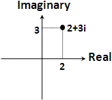
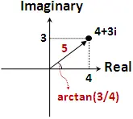
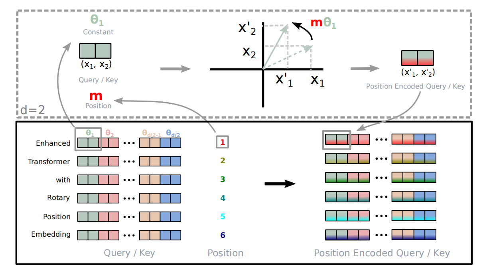

# 背景知识

理解原作者推导过程所需背景知识：
> 复数
旋转矩阵特性

## 复数的三种表示方法
### 1、直角坐标表示
复数空间中的每个数都可以表示为：$ a+bi$ 。其中 $a$ 为实部，$b$ 为虚部。例如下图 $ 2+3i$

### 2、极坐标表示
极坐标表示方法：$(r, \theta)$ 。其中 $r$ 为直角坐标中向量的长度，$\theta$ 为向量的角度

复数极坐标与直角坐标的转化：$(r, \theta)$ = $r*\cos \theta + r*i \sin\theta$

### 3、复指数表示
$e^{i \theta} $ = $r*\cos \theta + r*i \sin\theta$

## 旋转矩阵
**乘以一个向量的时候改变向量的方向，但是不改变大小。**
以二维空间下为例：把笛卡尔坐标的列向量关于原点逆时针旋转$\theta$ 的旋转矩阵 $R(\theta)$：
$\begin{pmatrix}  
  cos\theta  & -sin\theta  \\  
  sin\theta & cos\theta  
\end{pmatrix} $

旋转矩阵$R(\theta)$具有如下性质：
1. $R(a)^T = R(-a)$
2. $R(a) R(b) = R(a+b)$

# 旋转位置编码(Rope)

旋转位置编码，本质上是在attention阶段，希望找到这样一种位置编码：使得$q$和$k$向量经过位置编码$R$相乘后，两个向量的内积，可以表达其相对位置信息$(m-n)$，其中$m,n$为具体位置：
 $\langle  R(m)q, \ R(n)k\rangle $ = $\langle q, \ R(n-m)k\rangle $

而旋转矩阵就刚好满足这种特性，因此命名Rope。

## 理解方式一：
原文推导过程用到了矩阵运算、复数运算、欧拉公式、三角展开式，整体过程很繁琐。如果我们直接利用旋转矩阵的性质，推导会很简洁：
我们只需要证明:

$\langle  R(m)q, \ R(n)k\rangle $ = 
$  (R(m)q)^T \ R(n)k  $ = 
$  q^TR(m)^T \ \ R(n)k  $ = 
$  q^T R(n-m) k $ = 
$\langle  q, \ R(n-m)k\rangle $

## 理解方式二：
参见原文推导过程
[Sinusoidal位置编码追根溯源](https://kexue.fm/archives/8231)
[博采众长的旋转式位置编码](https://kexue.fm/archives/8265)

原文推导采用了复数的形式，并最终提出了这样一个公式，
二维向量下用复数表示的RoPE： $f(\mathbf{q} , m) = \mathbf{q}   e^{i \theta} $ 
其中$\mathbf{q}$ 用复数表示为： $q_0+q_1*i$

根据复数乘法，该变换实际上对应着向量的旋转，展开后写成矩阵形式：

$\begin{pmatrix}  
  cos \ m\theta  & -sin \ m\theta  \\  
  sin \ m\theta & cos \ m\theta  
\end{pmatrix} \begin{pmatrix}  
  q_0 \\
  q_1 
\end{pmatrix} $

可以看到位置编码也是个旋转矩阵。llama官方源码用这种复数$(q_0 + iq_1)  e^{i \theta} $ = $(q_0 + iq_1) ( \cos \theta + i \sin\theta) $ 的思路实现。

## 多维情况（两两分组）
上边是假定词嵌入维度是2，对于多维情况，则是将词嵌入向量两两分组，每组应用上边的旋转操作，且每组的旋转角度$\theta$计算方式采用Sinusoidal方式：$\theta_i =  10000^{-2i/d}$
rope论文中有个很直观的图片展示了旋转变换的过程：

## $\theta$的选择
每组的旋转角度采用google Sinusoidal方式：$\theta_i =  10000^{-2i/d}$
这种形式有个良好的性质，他可以随着$|m-n|$的增大，$\langle  R(m)q, \ R(n)k\rangle $有趋近于零的趋势，即远程衰减。即相对距离越大的输入，其相关性越弱，符合我们的认知。

几乎每个[0,1]上的单调光滑函数$\theta_t$，都具有这种远程衰减的特性。后边大多沿用了google的方案。

# 参考
https://zhuanlan.zhihu.com/p/642884818
https://kexue.fm/archives/8231
https://kexue.fm/archives/8130
https://kexue.fm/archives/8265
https://zh.wikipedia.org/wiki/%E6%97%8B%E8%BD%AC%E7%9F%A9%E9%98%B5
https://mengqi92.github.io/2015/10/06/complex/

